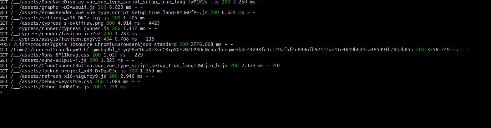

# Testing Strategy

## Unit Testing
- Client: React components, hooks, utilities
- Server: Models, middleware, services

## Integration Testing
- API endpoints with database interactions
- React components with API dependencies

## End-to-End Testing
- Critical user flows with Cypress

## Coverage Goals
- 70% minimum for all files
- 90%+ for critical components

## Running Tests
- `npm test` - Run all tests
- `npm run test:unit` - Unit tests only
- `npm run test:integration` - Integration tests
- `npm run test:e2e` - End-to-end tests

